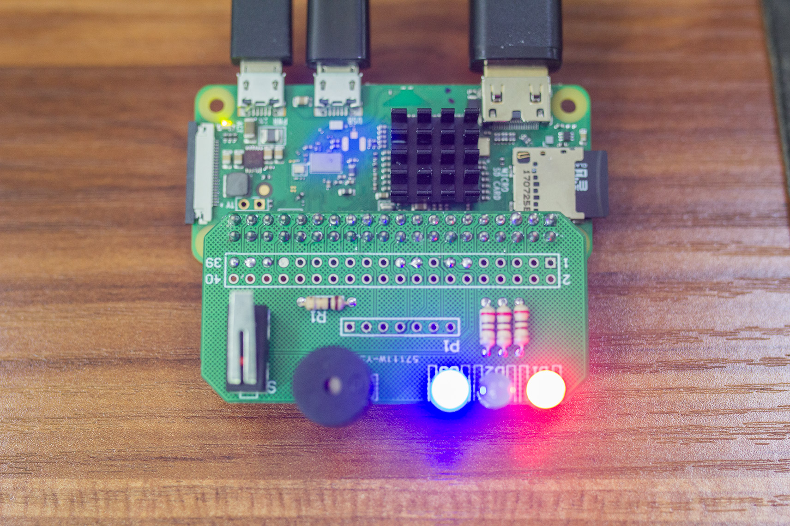
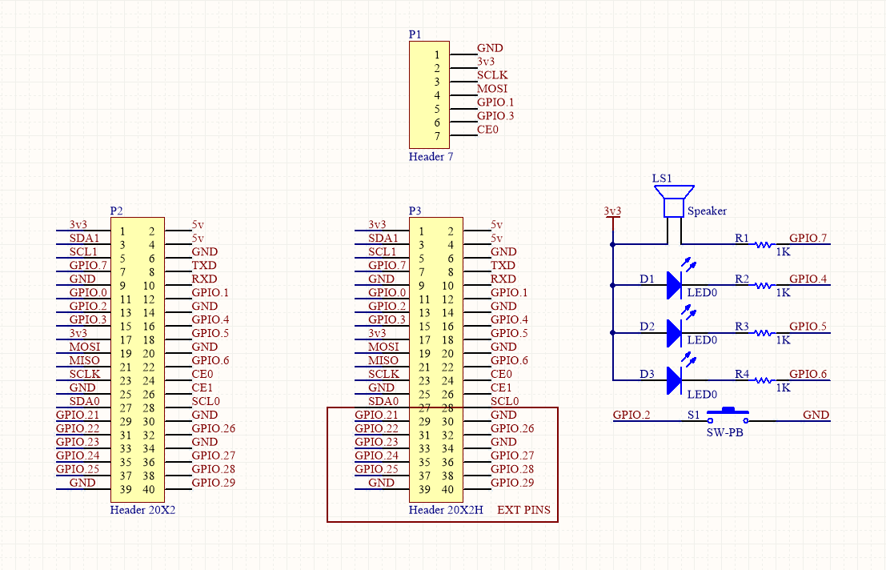

# raspi-jlink-downloader
一个运行于树莓派上的jlink量产烧录器

## 安装

1. 从jlink官网下载jlink for arm包，在树莓派上解压。
1. 使用`ln -s`在`/sbin`目录下建立`JLinkExe`的软链接，这样就可以使用`sudo JLinkExe`直接启动。
1. 在`windows`上以`arm5`为目标平台交叉编译出二进制程序（如出现gcc依赖问题，尝试关闭`CGO_ENABLE`选项），这样可以省去在树莓派上配置`golang`环境的麻烦。
1. 复制编译好的二进制程序到树莓派目录。使用`chmod +x`赋予可执行权限。
1. 使用`sudo`身份运行程序。

## 部署

1. 使用`sudo vi /etc/rc.local`编辑文件，在最后`exit`之前加上一行`exec 程序路径`，即可实现自动启动。
1. 如果需要开机自动登陆，可使用`raspi-config`配置自动登陆。

## 说明

项目`hw`目录下为硬件设计文件，`src`目录为烧录程序`golang`源码。

